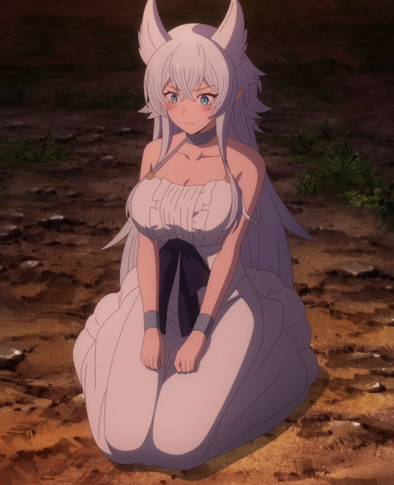
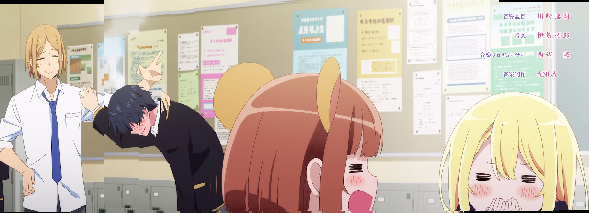

Yuzuriha

Command line tool to process (anime) video file into stiches automatically.

Prototype very early into development, don't expect anything for all but simplest stiches. Also it will likely leak lots of memory so better monitor your RAM usage and stop it when it gets too high. Currently hardcoded to 1080p.

Usage: drag and drop video file on the executable. This will create new folder with the same name as video at the same location (if folder already exists it will be deleted) which will contain stiches.

Examples:

Okay stich:

Not okay stich:

Issues to work on:
* Don't hardcode 1080p
* Rotating frames
* Scaling frames
* Selecting median pixels
* Parallax effect
* Possibly feature matching
* Possibly scale space usage
* Smoother stiching
* Determining when to stop stich (small frame area being relevant, frames blinking, etc.)
* Linux
